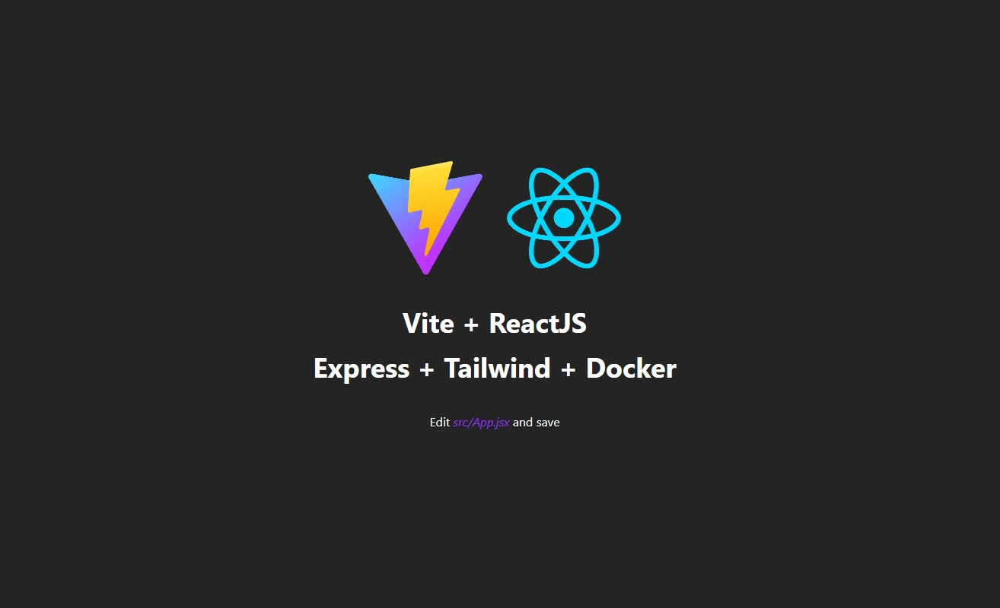

# vite-reactjs-express-tailwind-docker
A boilerplate development environment for Vite + React.js + Express + Tailwind CSS running in Docker/Desktop.



# Usage
Ensure that the Docker daemon is already running.

```bash
# Clone this repository
git clone https://github.com/sateshcharan/vite-reactjs-express-tailwind-docker.git

# Run the Docker containers
docker-compose up -d